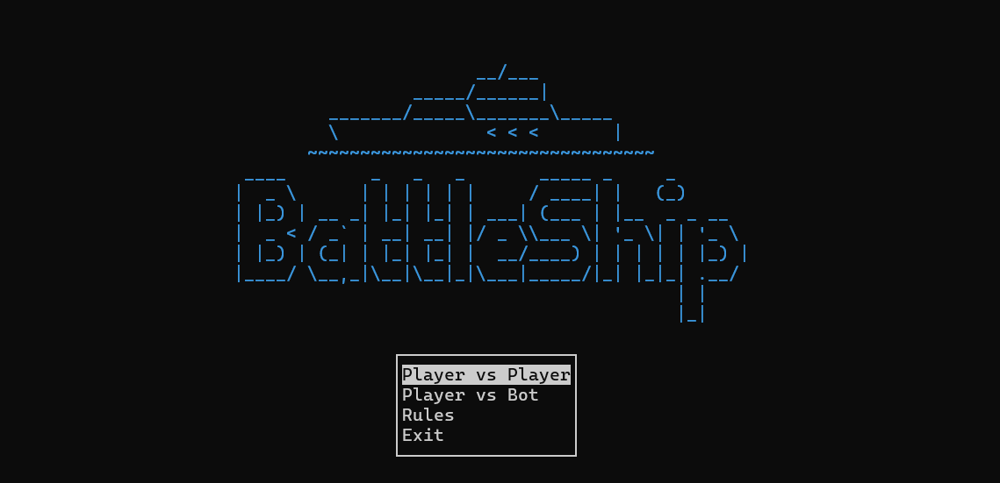

# CLI-Battleship



A terminal-based implementation of the classic Battleship game with C++ and NCurses/PDCurses.

## Features

- Classic Battleship gameplay
- Cross-platform support (Windows/Linux)
- Terminal-based UI with color support
- Single-player vs AI mode

## Prerequisites

- C++17 compatible compiler
- CMake (version 3.15 or higher)
- NCurses (Linux) or PDCurses (Windows)

## Installation

### Linux

1. Install dependencies:
   ```bash
   # Debian/Ubuntu
   sudo apt-get install build-essential cmake libncursesw5-dev

   # Fedora
   sudo dnf install gcc-c++ cmake ncurses-devel
   ```

2. Clone and build:
   ```bash
   git clone https://github.com/ValterGames-Coder/CLI-BattleShip.git
   cd cli-battleship
   mkdir build && cd build
   cmake ..
   make
   ```

### Windows

1. Install prerequisites:
   - [Visual Studio](https://visualstudio.microsoft.com/) with C++ support
   - [vcpkg](https://vcpkg.io/) for dependencies

2. Set up vcpkg:
   ```powershell
   git clone https://github.com/microsoft/vcpkg.git
   cd vcpkg
   .\bootstrap-vcpkg.bat
   .\vcpkg install pdcurses:x64-windows
   .\vcpkg integrate install
   ```

3. Build the project (use x64 Native Tools Command Promt for VS):
   ```powershell
   git clone https://github.com/ValterGames-Coder/CLI-BattleShip.git
   cd cli-battleship
   mkdir build
   cd build
   cmake -DCMAKE_TOOLCHAIN_FILE="C:\vcpkg\scripts\buildsystems\vcpkg.cmake" ..
   cmake --build . --config Release
   ```

## Running the Game

After building, run the executable:

```bash
# Linux
cd build/bin/
./battleship

# Windows
.\build\bin\Release\battleship.exe
```

## License

This project is licensed under the MIT License - see the [LICENSE](https://github.com/ValterGames-Coder/CLI-BattleShip/blob/master/LICENSE) file for details.
